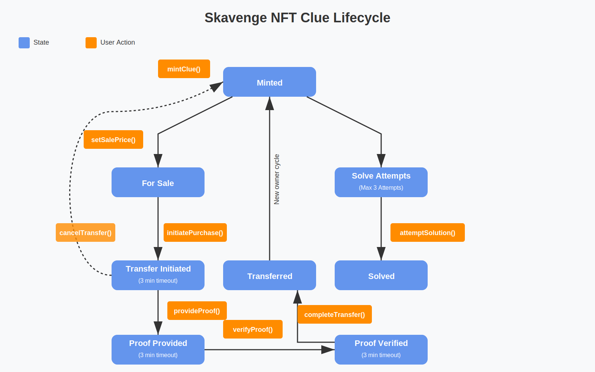

# Skavenge NFT Scavenger Hunt

Skavenge is an NFT-based scavenger hunt game implemented on Ethereum. Players can mint, solve, and trade clues as NFTs using ElGamal encryption and cryptographic proofs for secure transfers.



## Overview

Skavenge combines blockchain technology, cryptography, and gamification to create a decentralized scavenger hunt where:
- Clues are ERC721 NFTs with encrypted content
- Solutions are verified on-chain through hash matching
- Clues can be traded securely between players using cryptographic proofs
- Solved clues earn point values that determine chances of winning prizes
- Optional solve rewards provide immediate ETH incentives

## Project Structure

```
/skavenge
├── cmd/
│   ├── generate-query-cli/  # CLI generator for contract queries
│   ├── skavenge-query/      # Generated CLI tool (auto-generated)
│   └── setup/               # Contract deployment tool
├── eth/
│   ├── bindings/            # Go bindings for Ethereum contracts
│   ├── build/               # Compiled contract artifacts
│   └── skavenge.sol         # Solidity smart contract
├── linked-accounts-gateway/ # Gateway for account linking and transfer data
├── skavenger-extension/     # Browser extension for key management
├── tests/
│   ├── util/                # Test utilities
│   ├── mint_test.go         # Tests for minting clues
│   ├── solve_test.go        # Tests for solving clues
│   └── transfer_test.go     # Tests for transferring clues
├── webapp/                  # React web application
├── zkproof/                 # Cryptographic proof utilities
└── Makefile                 # Build and test automation
```

## Features

- **Minting Clues**: Create new clues with ElGamal-encrypted content, solution hashes, point values, and optional solve rewards
- **Solving Clues**: Attempt to solve clues by submitting solutions that are verified against on-chain hashes
- **Trading Clues**: Securely transfer unsolved clues to other players using cryptographic proof verification
- **Point System**: Solved clues award point values (1-5) that determine a player's chances of winning the grand prize
- **Solve Rewards**: Optional ETH rewards automatically distributed when a clue is solved
- **Transfer Protection**: Prevents transfer of solved clues to maintain game integrity
- **Account Linking**: Links Ethereum addresses to Skavenge public keys for secure operations
- **CLI Query Tool**: Auto-generated command-line interface for contract queries

## Technology Stack

- **Smart Contracts**: Solidity ^0.8.20 with OpenZeppelin ERC721Enumerable
- **Cryptography**: ElGamal encryption on secp256k1 curve, ECDSA signatures
- **Blockchain**: Ethereum (compatible with any EVM chain)
- **Frontend**: React 18 with Web3.js
- **Backend**: Go with ethereum/go-ethereum client
- **Gateway**: Go HTTP server for account linking and transfer coordination
- **Browser Extension**: Chrome extension for secure key management
- **Testing**: Go test suite with Hardhat local blockchain
- **Container Orchestration**: Docker Compose

## Quick Start

The easiest way to run Skavenge locally is using Docker Compose, which sets up all required services.

### Prerequisites

- Docker and Docker Compose
- Git
- Chrome browser
- MetaMask browser extension

### Running Locally

1. **Clone the repository**:
   ```bash
   git clone https://github.com/deelawn/skavenge.git
   cd skavenge
   ```

2. **Install and configure MetaMask**:
   - Install the [MetaMask browser extension](https://metamask.io/)
   - Create a new Ethereum account specifically for Skavenge (recommended for security)
   - Export the private key from MetaMask:
     - Click the account menu (three dots)
     - Select "Account details"
     - Click "Show private key"
     - Enter your MetaMask password
     - Copy the private key

3. **Install and configure the Skavenger extension**:
   - Open Chrome and navigate to `chrome://extensions/`
   - Enable "Developer mode" (toggle in top right)
   - Click "Load unpacked"
   - Select the `skavenger-extension` directory from this repository
   - Note the extension ID (should be `hnbligdjmpihmhhgajlfjmckcnmnofbn`)
   - Click on the Skavenger extension icon in your browser
   - Generate a new key pair by clicking "Generate New Keys"
   - Set a password to encrypt your keys
   - Export the private key:
     - Click "Export Keys"
     - Enter your password
     - Copy the private key (the hex string without "0x" prefix)

4. **Create and configure test-config.json**:
   ```bash
   cp test-config.json.example test-config.json
   ```

   Edit `test-config.json` and add your private keys:
   ```json
   {
     "privateKey": "YOUR_METAMASK_PRIVATE_KEY_HERE",
     "skavengePrivateKey": "YOUR_SKAVENGER_PRIVATE_KEY_HERE",
     "hardhatUrl": "http://hardhat:8545"
   }
   ```

   **Important**: Both private keys should be hex strings without the "0x" prefix.

5. **Start all services**:
   ```bash
   make start-with-setup
   ```

   This command will:
   - Start a local Hardhat Ethereum node
   - Deploy the Skavenge smart contract
   - Start the linked accounts gateway
   - Start the React web application

   Services will be available at:
   - **Hardhat Node**: http://localhost:8545
   - **Web Application**: http://localhost:8080
   - **Gateway API**: http://localhost:4591

6. **Access the web app**:
   - Open http://localhost:8080 in your browser
   - Connect your Skavenger extension
   - Connect MetaMask
   - Start playing!

### Stopping Services

```bash
make stop
```

### Rebuilding

If you make changes to the code:

```bash
# Rebuild all images
make docker-build

# Restart with new images
make start-with-setup
```

## Testing

The project includes comprehensive tests for all smart contract functionality.

### Using Docker

```bash
# Build and run tests in containers
make docker-test
```

### Local Testing

```bash
# Start Hardhat node
make docker-up

# Run tests
go test ./tests/...

# Clean up
make docker-down
```

### Running Specific Tests

```bash
# Test minting
go test ./tests -run TestMint

# Test solving
go test ./tests -run TestSolve

# Test transfers
go test ./tests -run TestTransfer
```

## Architecture

### Smart Contract

The `Skavenge.sol` contract is an ERC721Enumerable token with custom functionality:
- Each token represents an encrypted clue
- Clues store ElGamal-encrypted content, solution hashes, and metadata
- Players can list clues for sale and initiate secure transfers
- Transfer requires cryptographic proof verification to prevent cheating
- Solved clues cannot be transferred

### Linked Accounts Gateway

A Go HTTP server that provides:
- **Account Linking**: Maps Ethereum addresses to Skavenge public keys via signature verification
- **Transfer Coordination**: Stores encrypted transfer data for secure clue transfers
- **Signature Verification**: Validates Ethereum and Skavenge ECDSA signatures

### Browser Extension

A Chrome extension that:
- Generates and stores secp256k1 key pairs
- Signs messages for authentication
- Performs ElGamal decryption
- Generates cryptographic proofs for transfers
- Keeps private keys secure (never exposed to web apps)

### Web Application

A React SPA that:
- Connects to MetaMask for blockchain transactions
- Connects to Skavenger extension for cryptographic operations
- Provides UI for minting, solving, and trading clues
- Manages the complete user experience

## How It Works

### Minting a Clue

1. Clue creator generates encrypted content using ElGamal encryption
2. Creator submits transaction with encrypted content, solution hash, point value, and optional reward
3. Contract mints a new NFT and stores the clue data
4. Creator can list the clue for sale or attempt to solve it themselves

### Solving a Clue

1. Player who owns a clue can attempt to solve it
2. Player submits their solution to `attemptSolution()`
3. Contract hashes the solution and compares it to the stored hash
4. If correct:
   - Clue is marked as solved
   - Point value is awarded to the player
   - Solve reward (if any) is transferred to the player
5. If incorrect, the transaction reverts

### Trading a Clue

1. Seller lists clue for sale using `setSalePrice()`
2. Buyer initiates purchase, locking the price in the contract
3. Seller generates re-encrypted content for buyer and provides proof
4. Buyer verifies the proof
5. Contract validates proof and completes transfer
6. If any step times out, either party can cancel and reclaim funds

## Configuration

### test-config.json

Used by the setup tool to deploy contracts and initialize the system. You must create this file with your private keys before running `make start`:

```json
{
  "privateKey": "YOUR_METAMASK_PRIVATE_KEY_HERE",
  "skavengePrivateKey": "YOUR_SKAVENGER_PRIVATE_KEY_HERE",
  "hardhatUrl": "http://hardhat:8545"
}
```

**Fields:**
- `privateKey`: Private key from your MetaMask account (without "0x" prefix)
- `skavengePrivateKey`: Private key from your Skavenger extension (without "0x" prefix)
- `hardhatUrl`: URL of the Hardhat node (use `http://hardhat:8545` for Docker, `http://localhost:8545` for local)

### webapp/config.json

Auto-generated by the setup tool. Contains:
```json
{
  "contractAddress": "0x...",
  "networkRpcUrl": "http://localhost:8545",
  "chainId": 1337,
  "gatewayUrl": "http://localhost:4591"
}
```

This file is automatically created when you run `make start`.

## Makefile Targets

- `make start` - Start all services with Docker Compose
- `make stop` - Stop all services
- `make docker-build` - Build all Docker images
- `make docker-test` - Run tests in containers
- `make compile` - Compile Solidity to Go bindings
- `make compile-js` - Compile Solidity to JavaScript ABI
- `make generate-cli` - Generate CLI query tool
- `make setup` - Deploy contract (Docker)
- `make setup-local` - Deploy contract (local)

## Documentation

- [Web Application README](webapp/README.md) - Detailed webapp documentation
- [Gateway README](linked-accounts-gateway/README.md) - Gateway API documentation
- [Extension README](skavenger-extension/README.md) - Browser extension guide

## License

TBD
